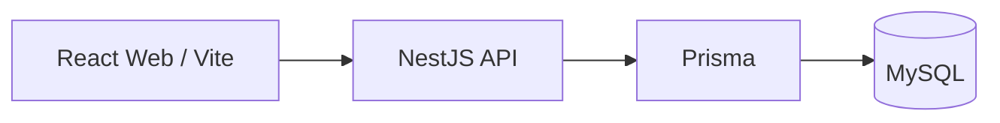

# Phase 1 — Architecture

## Scope and sources

Documentation/design only. No Prisma changes, migrations, endpoints, screens, auth/RBAC implementation, seeds, or business services are introduced.

Sources: [requirements](requirements.md), [confirmed answers](decisions.md), the current Phase 1 request, and [unresolved questions](open-questions.md). Requirement section numbers and decision answer numbers below refer to those files. Decisions supply explicit clarifications; contradictory grants remain OPEN, not silently resolved. The requirements file is preserved unchanged.

## Production structure

Coolify hosts the web build, API runtime, and configured MySQL deployment. Browser traffic reaches the API; database access and credentials remain server-side. Retain the npm monorepo: `apps/web`, `apps/api`, `packages/shared`. Shared contracts must not contain credentials or expose database implementation types to the browser.

Technical design choice: one modular NestJS application and one MySQL database. No microservices, message broker, event bus, generic repository layer, or external integrations are needed for this scope. Module names describe ownership, not a requirement to create one service per table.

## Modules and responsibilities

| Module        | Responsibility / interface                                                                                                                               | Explicit limit                                                                           |
| ------------- | -------------------------------------------------------------------------------------------------------------------------------------------------------- | ---------------------------------------------------------------------------------------- |
| Auth          | Authenticate Staff ID/password and supply trusted actor context; cookie/session authentication; ADMIN password reset; minimum password length 8 (D28–30) | Session lifecycle, lockout and MFA remain OPEN                                           |
| Staff / Users | Staff membership and account administration; exactly one Branch for branch-bound Staff/Managers                                                          | ADMIN account membership representation is OPEN                                          |
| Roles         | ADMIN, MANAGER, STAFF, STOCK, CASHIER assignments and union of assigned grants (D1)                                                                      | No implicit operational role inheritance                                                 |
| Branches      | Branch Code, Branch Name, Phone; ADMIN management                                                                                                        | No additional business fields                                                            |
| Customers     | Customer ID and manually collected Phone Number                                                                                                          | No extra personal fields or assumed unique phone                                         |
| Sessions      | Own lifecycle, decision, purchase selection/confirmation, cancellation and DEMO workload invariant                                                       | No inferred transitions or timeout; multiple active sessions per Customer allowed (D5–8) |
| Products      | Local Category/Product/Model/SKU master and ADMIN CRUD                                                                                                   | Hierarchy/FKs and mock records remain OPEN (D12–14); no external integration             |
| Accessories   | Fixed options and session selections with quantity                                                                                                       | No version-one master management UI                                                      |
| Ontop         | Fixed multi-select options                                                                                                                               | No amount/value                                                                          |
| Points        | Fixed multi-select options                                                                                                                               | No quantity or value                                                                     |
| Burn Points   | Fixed multi-select options, separate from Points selections                                                                                              | No quantity or value                                                                     |
| Payments      | Fixed multi-select methods                                                                                                                               | No amount, fee, discount or transaction amount                                           |
| Stock         | Role-specific Stock actions, request visibility and optional out-of-stock note                                                                           | Calls Sessions transition interface; cannot bypass lifecycle constraints                 |
| Cashier       | Dedicated receipt/scan/bill actions and separate completion action                                                                                       | No FileMaker integration or Invoice/Bill/Transaction IDs in version one                  |
| Events        | Append approved SessionEvent records in the same transaction as accepted actions                                                                         | No mutation/deletion, unapproved event types or arbitrary client metadata                |
| Reports       | Read operational records for Dashboard/Reports                                                                                                           | No invented metrics, formulas, filters or aggregation                                    |
| Exports       | Excel/CSV output from authorized operational reads                                                                                                       | Column schema and report definitions remain OPEN                                         |

Selections remain part of the Session consistency boundary even where option ownership is separate. Stock and Cashier own their action interfaces; Sessions owns state changes so guards are not duplicated. Events stores history rather than orchestrating workflows. Reports/Exports do not mutate Sessions. Interfaces should encapsulate invariants; avoid pass-through abstractions.

## Command consistency and security design

Future action handling will authenticate the actor, evaluate assigned grants and data scope, validate input, and perform one database transaction that checks current state, writes the permitted changes/timestamp, and appends its approved event. Commit all changes or none. Do not accept client actor identity or authoritative timestamps. Recheck state inside the transaction to prevent confirmation/edit and cancel/progress races.

Technical design: serialize competing updates for a Session using database transaction concurrency controls. Enforce one active DEMO per Staff through an atomic Staff workload check, not a client check. Exact locking/index mechanics are deferred until the physical schema is approved; no added business state or timestamp is implied. Retry semantics and ownership handoff are OPEN.

Use both explicit operational timestamp fields and append-only SessionEvent history; this is not event sourcing. See [ERD](erd.md) for mappings. Use a server clock and consistent UTC storage/serialization as a technical convention; the business timezone for daily reference numbering remains OPEN. Never derive new business timestamps automatically at transition boundaries without a specified action.

Existing Helmet, environment-based CORS, ValidationPipe, TypeScript strict, ESLint and Prettier remain the baseline. DTOs will be created with actual action contracts. Cookie authentication requires a CSRF protection design before auth implementation; no library/session store is selected here. Secrets are injected by environment. Production domains, cookie deployment settings and database settings await deployment decisions.

## Frontend and deployment

React uses feature-oriented organization for the documented workflow areas. UI visibility reflects permissions, but API authorization is authoritative. No screens are designed or implemented here. Initial `/health` remains a liveness endpoint; database readiness is not claimed. Build outputs and npm commands remain as documented in [README](../README.md).

Reports and exports will consume raw operational data with server-side scope enforcement. No KPI computation is designed. Deploy web/API through Coolify after production settings are supplied (D38); no deployment is performed in Phase 1.

## Design dependencies

[State machine](state-machine.md), [permission matrix](permissions.md), and [conceptual ERD](erd.md) are mutually constrained. OPEN items block only their affected physical schema/action design, not the confirmed conceptual architecture. No design proposal here upgrades an OPEN requirement into a confirmed business rule.
