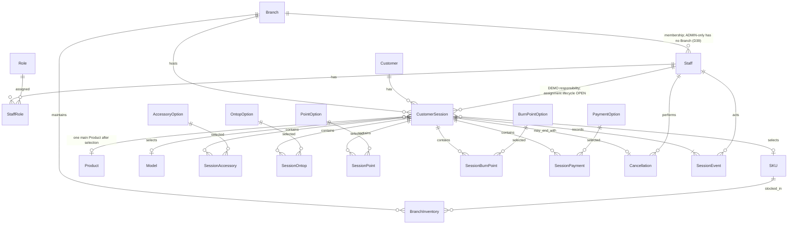
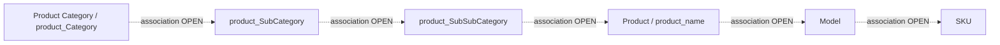

# Phase 1 — Conceptual ERD and integrity

Sources: requirements §§5–25, 26, 32, 38, 40 and decisions D5–15, D17–30. This is a conceptual design, not an approved physical schema. Workflow models remain unimplemented; the account-only schema/migrations authorized by D39 are documented below. Technical choices below are distinguished from confirmed fields; OPEN details must be settled before their affected constraints are implemented.

## Conceptual relationships



Product master concepts are shown separately without invented cardinalities:



This is the unfinalized hierarchy from D13, not approved foreign keys. SubCategory/SubSubCategory placement is OPEN; the diagrams must not be translated mechanically into migrations. Staff–Session represents responsibility, not a confirmed non-null assignment at walk-in. Staff–Branch applies exactly once to Staff/Manager; ADMIN-only accounts have no Branch, while mixed branch-bound roles require one Branch (D39). Stock/Cashier are lifecycle portions of CustomerSession in this design, not independent duplicate workflow tables.

## Entity definitions

| Concept                                  | Confirmed data / responsibility                                                                                                             | Design and unresolved details                                                                                                             |
| ---------------------------------------- | ------------------------------------------------------------------------------------------------------------------------------------------- | ----------------------------------------------------------------------------------------------------------------------------------------- |
| Branch                                   | Branch Code, Branch Name, Phone                                                                                                             | Primary-key representation and Code uniqueness scope need confirmation                                                                    |
| Staff                                    | Staff ID (login username), password credential, one Branch for Staff/Manager                                                                | Store a password hash, never plaintext (technical choice); ADMIN-only has no Branch (D39); other unconfirmed fields remain OPEN           |
| Role                                     | Exactly ADMIN, MANAGER, STAFF, STOCK, CASHIER                                                                                               | Role code can identify fixed role records                                                                                                 |
| StaffRole                                | Staff-to-Role association                                                                                                                   | Technical choice: unique Staff/Role pair; no role hierarchy                                                                               |
| Customer                                 | Customer ID, Phone Number only                                                                                                              | Multiple Sessions over time and concurrently; exactly 10 ASCII digits before product selection; uniqueness OPEN                           |
| CustomerSession                          | Customer, Branch, responsible Staff, lifecycle/decision/result, selected Category/Product/Model/SKU, milestone fields, selections           | Session reference `SES-YYYYMMDD-NNNNNN`, daily sequence (D6); day timezone/scope OPEN. Assignment timing and physical state encoding OPEN |
| Product Category / Product / Model / SKU | Categories and selection down to SKU; D13 master labels `product_Category`, `product_SubCategory`, `product_SubSubCategory`, `product_name` | Local master; ADMIN CRUD; exact hierarchy, keys and FK deletion behavior OPEN                                                             |
| BranchInventory                          | `branchId`, `skuId`, `stock` (quantity), `active` (boolean status)                                                                          | Mapped per Branch and SKU; Admin controls stock quantity; Admin and Branch Manager control active status                                   |
| SessionAccessory                         | Session, selected accessory, quantity                                                                                                       | Multiple selections; positive integer quantity, initial value 1; maximum/duplicate handling OPEN                                          |
| SessionOntop                             | Session, selected Ontop                                                                                                                     | Multiple selections; no amount/value                                                                                                      |
| SessionPoint                             | Session, selected Points option                                                                                                             | Multiple selections; no quantity/amount/value                                                                                             |
| SessionBurnPoint                         | Session, selected Burn Point option                                                                                                         | Separate relationship from Points; no quantity/amount/value                                                                               |
| SessionPayment                           | Session, selected Payment method                                                                                                            | Multiple selections; no amount, fee, discount or transaction amount                                                                       |
| Stock workflow                           | Session state/actions, Stock timestamps, optional OUT_OF_STOCK reason/note (D23)                                                            | Store on Session conceptually; no unconfirmed assignee/retry timestamps                                                                   |
| Cashier workflow                         | Session states, dedicated receipt/scan/bill actions, separate completion                                                                    | No Invoice Number, Bill Number, Transaction ID or FileMaker integration (D26)                                                             |
| Cancellation                             | Session, `reason`, `otherReason`, `cancelledBy`, `cancelledAt`                                                                              | Technical mapping `cancelledAt` → `cancelled_at`; one optional record because cancellation is terminal; text required for `อื่น ๆ`        |
| SessionEvent                             | `id`, `sessionId`, `eventType`, `actorStaffId`, `createdAt`, `metadata`                                                                     | Approved by D27; server-created, no update/delete; structured JSON only for necessary event context                                       |

The association names above are design vocabulary, not added business fields. Exact technical IDs, lengths, index definitions and referential actions are deferred to physical design. No blanket `created_at`/`updated_at`, deletion timestamps, money fields, or arbitrary Customer/Branch fields are added.

Main Product is absent at walk-in and selected during Product Selection (D8). This clarifies the older “exactly one” invariant as one main Product when selected, not a fabricated mandatory Product at creation. A completed purchase cannot contain multiple main Products. No product is forced onto NOT_BUY Sessions.

Technical design: model selected options as child records rather than delimited strings. No selection means zero associated records; UI `None` never becomes a selected line. Option definitions are fixed for version one, with no Admin edit UI (D15). Quantity belongs only to SessionAccessory. Whether an option may appear more than once must be confirmed before adding pair uniqueness constraints.

## Exact business options

Lists preserve source spelling/case. `None` is a UI no-selection option, excluded from selection persistence.

| Set                 | Exact options                                                                                                                                                                                                                                                  |
| ------------------- | -------------------------------------------------------------------------------------------------------------------------------------------------------------------------------------------------------------------------------------------------------------- |
| Product Category    | `iPhone`, `iPad`, `Mac`, `Watch`, `Accessories`                                                                                                                                                                                |
| Accessories         | `Apple Pencil`, `Apple Keyboard`, `Magic Mouse`, `Magic Trackpad`, `Case`, `Protection`, `Power & Battery`, `AirPods & Audio`, `Adapters & Hubs`, `Charging`, `Storage / Connectivity`, `Headphones & speakers`, `Apple Care+`, `iProtect`, `Software`, `None` |
| Ontop               | `AIS`, `True`, `CATH`, `KTS`, `None`                                                                                                                                                                                                                           |
| Points              | `MCard`, `The 1`, `UJOY`, `None`                                                                                                                                                                                                                               |
| Burn Point          | `MCard`, `The 1`, `UJOY`, `None`                                                                                                                                                                                                                               |
| Payment             | `Cash`, `Transfer`, `SPayLater`, `TrueMoney`, `Full Credit Card`, `0% Credit Card`, `PayNext`, `UFund`, `Ulite`, `Thisshop`, `Kashjoy`                                                                                                                         |
| Decision            | `BUY`, `NOT_BUY`                                                                                                                                                                                                                                               |
| NOT_BUY result      | `ราคา`, `ยังไม่ตัดสินใจ`, `เปลี่ยนใจ`, `สินค้าไม่ตรงความต้องการ`, `ต้องการสอบถามราคาหรือรายละเอียดเฉยๆ`, `อื่น ๆ`                                                                                                                                              |
| Cancellation reason | `ลูกค้าเปลี่ยนใจ`, `รอนาน`, `อื่น ๆ`                                                                                                                                                                                                                           |
| Stock status        | `SEARCHING`, `FOUND`, `SENT_TO_CASHIER`, `OUT_OF_STOCK`, `CUSTOMER_CANCELLED`                                                                                                                                                                                  |

NOT_BUY `อื่น ๆ` requires additional text (`other_reason`, D17). This belongs to the decision result, distinct from cancellation `otherReason`. They must not be merged into an ambiguous shared reason field.

## Timestamp representation

Technical design: explicit Session milestone fields plus immutable SessionEvent history, written atomically. Cancellation time lives with Cancellation; do not duplicate it as an independently editable value on Session. Before an action occurs, its milestone is absent/null; do not fill skipped milestones with terminal time. These storage decisions do not require implementation in this phase.

| Original concept             | Explicit field                   | Actual trigger                   | Matching approved event     |
| ---------------------------- | -------------------------------- | -------------------------------- | --------------------------- |
| `startedAt` / walk-in        | `customer_walk_in_at`            | Session creation at walk-in      | SESSION_CREATED             |
| `demoStartedAt`              | `demo_start_at`                  | Begin DEMO                       | DEMO_STARTED                |
| `demoEndedAt`                | `demo_end_at`                    | End DEMO                         | DEMO_ENDED                  |
| Product Selection started    | `product_selection_start_at`     | Begin product selection          | PRODUCT_SELECTION_STARTED   |
| Product Selection confirmed  | `product_selection_confirmed_at` | Accept confirmation & Stock req  | PRODUCT_SELECTION_CONFIRMED |
| Stock started                | `stock_started_at`               | Press SEARCHING, not merely view | STOCK_SEARCHING             |
| Stock found                  | `stock_found_at`                 | Mark FOUND                       | STOCK_FOUND                 |
| Cashier received             | `cashier_received_at`            | Press รับสินค้า                  | CASHIER_RECEIVED            |
| Cashier scan                 | `cashier_scan_at`                | Press Scan                       | CASHIER_SCANNED             |
| Bill opened                  | `bill_opened_at`                 | Press เปิดบิล                    | BILL_OPENED                 |
| `decisionAt` / Decision      | `decision_at`                    | Customer decision recorded       | DECISION_MADE               |
| `cancelledAt` / Cancellation | `cancelled_at`                   | Cancellation confirmed           | CUSTOMER_CANCELLED          |

The first eleven fields are requirements §11; the final two were separately confirmed in §§13/25 and mapped in D10. They are not newly invented timestamps. `SessionEvent.createdAt` is separately approved by D27. Use the same server-generated instant for an action’s milestone and its corresponding event; separate actions retain separate actual times. No user may edit these values.

Technical convention: UTC instants; database temporal type/precision and reference-date timezone remain to be finalized. Do not compute or store duration/KPI fields yet. No extra operational timestamp is added for completion, closure, out-of-stock or handoff; event `createdAt` records those occurrences.

## Approved event vocabulary

Exactly D27’s event types:

```text
SESSION_CREATED
DEMO_STARTED
DEMO_ENDED
DECISION_MADE
PRODUCT_SELECTION_STARTED
PRODUCT_SELECTION_CONFIRMED
STOCK_REQUESTED
STOCK_SEARCHING
STOCK_FOUND
STOCK_SENT_TO_CASHIER
STOCK_OUT_OF_STOCK
CUSTOMER_CANCELLED
CASHIER_RECEIVED
CASHIER_SCANNED
BILL_OPENED
COMPLETED
```

`CASHIER_SCAN` is an action/state label; `CASHIER_SCANNED` is its event type. `SEARCHING` similarly emits `STOCK_SEARCHING`. Do not conflate enum vocabularies. No separate CLOSED/NOT_BUY/BUY event type is introduced. `DECISION_MADE` corresponds to the recorded decision.

Metadata is structured JSON limited to necessary event context (D27); it is not permission to accept arbitrary client JSON or add business fields. Define per-event metadata validation with the eventual action contract. D27 allows details to be completed during implementation, so this is not an unresolved choice of event types. No generic audit events for unconfirmed edits/master changes are introduced.

## Integrity and transaction strategy

| Invariant                              | Conceptual enforcement / remaining dependency                                                                                     |
| -------------------------------------- | --------------------------------------------------------------------------------------------------------------------------------- |
| Staff/Manager has exactly one Branch   | Required membership association/FK for branch-bound accounts; ADMIN-only has no Branch (D39)                                      |
| Multiple roles, union of grants        | StaffRole association; unique pair; authorization evaluates grants with data scope                                                |
| Customer may have many active Sessions | No single-active-session constraint on Customer                                                                                   |
| One active DEMO per Staff              | Atomic workload check and write inside transaction; physical concurrency mechanism deferred                                       |
| One main Product once selected         | Single Session main-product association; null before selection; hierarchy consistency awaits approved FKs                         |
| Confirmed purchase immutable           | Transaction checks confirmation before modifying any purchase field or selection; master updates must not rewrite history         |
| Option selections valid                | Relations to fixed options; no persisted None selection; quantity only on accessories; duplicate/maximum constraints OPEN         |
| Decision/cancellation reasons valid    | Restrict to exact options; required text for `อื่น ๆ`; trusted actor and time                                                     |
| Terminal outcomes final                | Validate current state within transaction; no progression, undo or auto-close                                                     |
| Timestamp accuracy/immutability        | Server-only creation; write each actual milestone once; no backfill of skipped actions                                            |
| SessionEvent immutable                 | Append in same transaction as state change; no update/delete path; physical permissions/referential actions must preserve history |
| Product CRUD preserves history         | Deletion and historical representation policy OPEN; do not cascade-delete operational records                                     |
| Unique Session reference               | Atomic allocation with uniqueness protection; date timezone, sequence scope and overflow rules OPEN                               |

FK/check constraints alone cannot enforce all cross-record authorization and lifecycle rules. Combine database integrity with transaction guards in the owning module. Do not assert that a schema-only constraint solves concurrent DEMO assignment. No additional concurrency timestamp/version field is prescribed here.

## Physical-design blockers

OQ-04–09 cover workflow state storage/action boundaries, master hierarchy/history, numbering and remaining data constraints. D39 separately authorizes the account-only physical implementation. Open permissions also gate action contracts. See [open questions](open-questions.md). This conceptual ERD must not be treated as permission to generate migrations before those details and the ERD are approved.

## Confirmed phone collection timing

Collect Customer Phone Number only after BUY. Walk-in/DEMO and NOT_BUY do not collect a phone number. This timing does not settle Customer identity creation/linking or physical nullability; those remain part of OQ-06/OQ-09.

## Implemented account-only physical model (D39)

The workflow ERD above remains conceptual. The current migrations implement only Branch, Staff, Role, StaffRole, LoginSession and a technical AccountLock mutex.

Branch has a technical UUID primary key plus confirmed code/name/phone and active status. Branch Code is not uniquely constrained while its business uniqueness scope is OPEN. Staff uses the login Staff ID as key, an optional Branch UUID FK, password hash, active/forced-change flags and failed-login/lockout data. The application atomically enforces Branch membership by assigned roles. No plaintext password is stored.

StaffRole has a unique Staff/Role pair; no inheritance. LoginSession stores only a token hash, Staff FK and server last-activity time. AccountLock serializes security-sensitive transactions to protect the last active ADMIN and other cross-record account guards. Technical session timestamps are unrelated to workflow milestones. No Customer/Session/product/workflow schema or event is implemented by these migrations.
