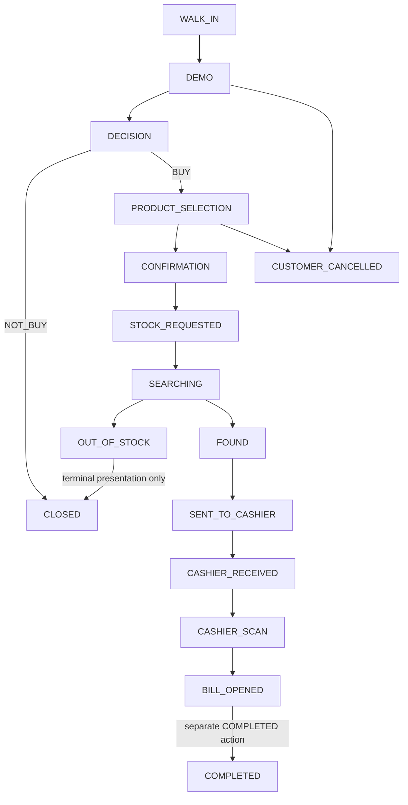

# Phase 1 — CustomerSession state machine

Sources: requirements §§9–14, 22–25, 39–40; decisions D5–11, D17–27; current Phase 1 flow. This is a conceptual transition specification, not a Prisma enum or endpoint contract. Action descriptions are labels, not new event identifiers.

## Confirmed flow

STAFF can trigger `CUSTOMER_CANCELLED` during DEMO, PRODUCT_SELECTION, STOCK and CASHIER; no additional STOCK/CASHIER role is required. This role permission is confirmed, not OPEN. Individual substate/action-boundary details remain OPEN; the diagram deliberately does not imply cancellation edges from every substate. `STOCK` and `CASHIER` are stage groups, not new persisted states. `BUY` and `NOT_BUY` are decision values; `NOT_PURCHASE` is not permitted (D11). No `NOT_FOUND` state exists.

`OUT_OF_STOCK` is immediately terminal. Its arrow to `CLOSED` describes the supplied high-level closure outcome, not a second action or an opportunity to reopen. `NOT_BUY` closes the Session immediately. Whether to persist a generic CLOSED state with an outcome or retain outcome-specific terminal values is OPEN (OQ-04). Preserve the outcome in either representation.

## Transition/action table

All actors below are authenticated. ADMIN Stock/Cashier grants come from explicit D1 action entries, not from global scope; other grants and conflicts are detailed in [permissions](permissions.md). “None” means no additional explicit business timestamp; an approved event still has server-generated `createdAt`.

| Current state / entry                               | Allowed action or outcome                            | Actor/role                                             | Explicit timestamp                                                       | Next state                   | Approved event                                           |
| --------------------------------------------------- | ---------------------------------------------------- | ------------------------------------------------------ | ------------------------------------------------------------------------ | ---------------------------- | -------------------------------------------------------- |
| No Session yet                                      | Record walk-in/create Session                        | ADMIN or STAFF; MANAGER only with STAFF                | `customer_walk_in_at`                                                    | WALK_IN                      | SESSION_CREATED                                          |
| WALK_IN                                             | Begin DEMO                                           | STAFF; other roles OPEN                                | `demo_start_at`                                                          | DEMO                         | DEMO_STARTED                                             |
| DEMO                                                | End DEMO                                             | STAFF; other roles OPEN                                | `demo_end_at`                                                            | DECISION                     | DEMO_ENDED                                               |
| DECISION                                            | Record NOT_BUY with required result                  | Exact actor permission OPEN                            | `decision_at`                                                            | CLOSED, outcome NOT_BUY      | DECISION_MADE                                            |
| DECISION                                            | Record BUY, begin product selection                  | Decision permission OPEN; selection ADMIN/STAFF        | `decision_at`; `product_selection_start_at` at actual selection start    | PRODUCT_SELECTION            | DECISION_MADE; PRODUCT_SELECTION_STARTED at actual start |
| PRODUCT_SELECTION                                   | Select/edit purchase data before confirmation        | ADMIN/STAFF per matrix; ADMIN edit conflict OPEN       | None for edits                                                           | PRODUCT_SELECTION            | No approved edit event; do not invent one                |
| PRODUCT_SELECTION                                   | Enter/review Confirmation step                       | ADMIN/STAFF                                            | None for viewing                                                         | CONFIRMATION                 | None for viewing                                         |
| CONFIRMATION                                        | Confirm purchase and send request to Stock           | ADMIN/STAFF confirm; separate dispatch permission OPEN | `product_selection_confirmed_at`                                         | STOCK_REQUESTED              | PRODUCT_SELECTION_CONFIRMED                              |
| STOCK_REQUESTED                                     | Press SEARCHING; viewing alone does not start search | STOCK or ADMIN                                         | `stock_started_at`                                                       | SEARCHING                    | STOCK_SEARCHING                                          |
| SEARCHING                                           | Mark FOUND                                           | STOCK or ADMIN                                         | `stock_found_at`                                                         | FOUND                        | STOCK_FOUND                                              |
| SEARCHING                                           | Mark OUT_OF_STOCK; optional note                     | STOCK or ADMIN                                         | None                                                                     | OUT_OF_STOCK: terminal       | STOCK_OUT_OF_STOCK                                       |
| FOUND                                               | Press SENT TO CASHIER                                | STOCK or ADMIN                                         | None                                                                     | SENT_TO_CASHIER              | STOCK_SENT_TO_CASHIER                                    |
| SENT_TO_CASHIER                                     | Press รับสินค้า                                      | CASHIER or ADMIN                                       | `cashier_received_at`                                                    | CASHIER_RECEIVED             | CASHIER_RECEIVED                                         |
| CASHIER_RECEIVED                                    | Press Scan                                           | CASHIER or ADMIN                                       | `cashier_scan_at`                                                        | CASHIER_SCAN                 | CASHIER_SCANNED                                          |
| CASHIER_SCAN                                        | Press เปิดบิล                                        | CASHIER or ADMIN                                       | `bill_opened_at`                                                         | BILL_OPENED                  | BILL_OPENED                                              |
| BILL_OPENED                                         | Press separate COMPLETED action                      | CASHIER or ADMIN                                       | None                                                                     | COMPLETED: terminal          | COMPLETED                                                |
| DEMO or PRODUCT_SELECTION                           | Confirm cancellation                                 | STAFF; ADMIN conflict OPEN                             | `cancelled_at`                                                           | CUSTOMER_CANCELLED: terminal | CUSTOMER_CANCELLED                                       |
| Stock stage, eligible substates OPEN                | Confirm cancellation                                 | STAFF or STOCK; ADMIN conflict OPEN                    | `cancelled_at`                                                           | CUSTOMER_CANCELLED: terminal | CUSTOMER_CANCELLED                                       |
| Cashier stage, eligible substates OPEN              | Confirm cancellation                                 | STAFF or CASHIER; ADMIN conflict OPEN                  | `cancelled_at`                                                           | CUSTOMER_CANCELLED: terminal | CUSTOMER_CANCELLED                                       |
| CLOSED, OUT_OF_STOCK, CUSTOMER_CANCELLED, COMPLETED | No progression/reopen                                | No role override                                       | None                                                                     | None                         | None                                                     |

Role permissions are the union of assigned roles. MANAGER alone receives no automatic STAFF/STOCK/CASHIER workflow permissions. MANAGER + STAFF receives STAFF actions, including cancellation in all four confirmed stages; MANAGER + STOCK receives STOCK actions; MANAGER + CASHIER receives CASHIER actions; MANAGER + STAFF + STOCK + CASHIER receives the union of all four roles. Each combination remains restricted to the Manager’s own Branch. Exact decision authorization, start/selection action coupling, confirmation/dispatch coupling, and return-to-edit navigation before confirmation remain OPEN; the high-level arrows do not authorize invented intermediate states. `CONFIRMATION` represents the confirmed review step; persistently distinguishing review from accepted confirmation is OPEN (OQ-05).

## Action guards and outcomes

- Create at walk-in with no Product; multiple active Sessions for one Customer are allowed (D5, D8). Never add auto-timeout/abandonment/closure (D7).
- Start DEMO only when that Staff has no other active DEMO. Release of workload on DEMO end or terminal cancellation must be atomic; reassignment rules remain OPEN.
- Capture decision from exactly `BUY`, `NOT_BUY`. NOT_BUY result is exactly: `ราคา`, `ยังไม่ตัดสินใจ`, `เปลี่ยนใจ`, `สินค้าไม่ตรงความต้องการ`, `ต้องการสอบถามราคาหรือรายละเอียดเฉยๆ`, `อื่น ๆ`. For `อื่น ๆ`, additional text is required (D17).
- Purchase fields and selections are editable only before accepted confirmation. Do not silently add a reverse transition from CONFIRMATION or later states. Confirmation and Stock request timestamps must reflect their actual actions, even if eventually implemented as one command.
- Cancellation requires select reason → additional text when applicable → confirmation → terminal outcome → return to queue (D18–20). Exact reasons: `ลูกค้าเปลี่ยนใจ`, `รอนาน`, `อื่น ๆ`. Text is optional for the first two, required for `อื่น ๆ`. Store trusted actor, reason/text and server time. No undo/reopen.
- No synthetic `demo_end_at`, `stock_found_at`, or other unperformed milestone is written when cancellation/out-of-stock skips it. Their terminal event records the actual outcome.
- Every accepted transition is atomic with its approved event. Duplicate clicks/retries must not overwrite timestamps or create a second accepted transition; the response/idempotency contract is OPEN.

## Timestamp and terminal interpretation

All eleven milestone fields plus explicitly confirmed `decision_at`, `cancelled_at`, and SessionEvent `createdAt` are defined in [ERD](erd.md). No `completed_at`, `closed_at`, `sent_to_cashier_at` or `out_of_stock_at` is added. Their approved events carry occurrence time.

Blocking action/state uncertainties: OQ-01, OQ-02, OQ-04, OQ-05 and OQ-06 in [open questions](open-questions.md). No unlisted edge is authorized by this design.
